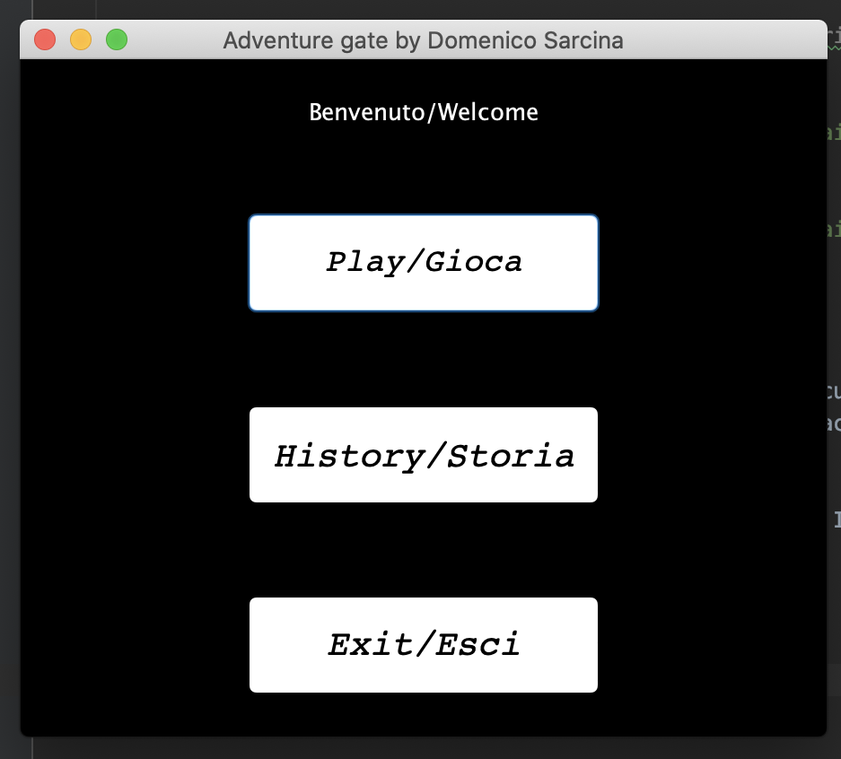
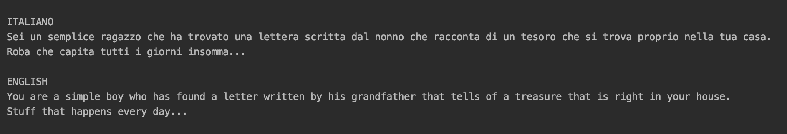
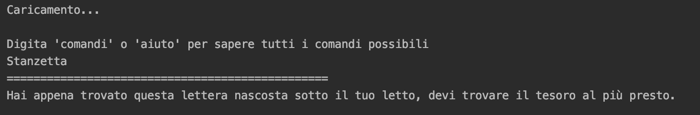
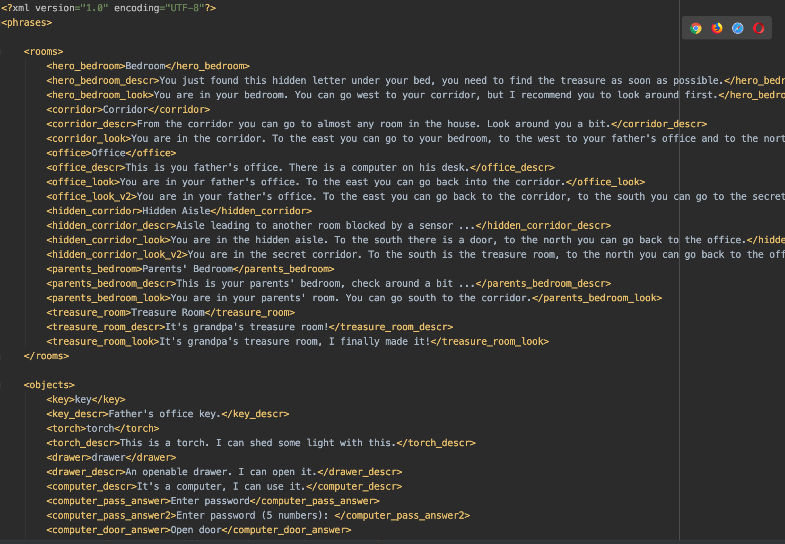

# Adventure gate by Domenico Sarcina

## Relazione finale progetto

## 1.Introduzione

Per il corso **Metodi Avanzati di Programmazione** è stato realizzato come progetto finale 
un'avventura testuale. Per la realizzazione di essa è stato utilizzato **Java** come linguaggio di programmazione,
**XML** come linguaggio per i file di tipo .xml ed infine **Maven** come strumento di build automation.

## 2. Strutture Dati

Per l'avventura testuale sono state definite alcune strutture dati, queste sono:

***Action***: Definisce un solo metodo, ovvero quello utilizzato per le azioni che si verificano a seconda di una scelta

***AdvObject***: Definisce la composizione di un oggetto, con tutti i suoi attributi e metodi

***AdvObjectContainer***: Sotto classe di AdvObject, definisce la composizione di un oggetto contenitore

***Answer***: Definisce la singola scelta in un dialogo tra oggetto e utente

***Command***: Definisce il singolo comando di gioco

***Command Type***: Definisce  i tipi di comandi che sono presenti nel gioco

***Dialogue***: Definsice il dialogo completo, con una lista di Answer. del singolo oggetto

***Inventory***: Definisce la composizione dell'inventario dell'utente, ovvero una lista di oggetti

***Player***: Definisce il nome dell'utente, personalizzabile ad inizio gioco

***Room***: Definisce la composizione della singola stanza nel gioco

***Language***: Definsice la lingua del gioco, italiano o inglese

#### AdvObject ####

|      id      | codice identificativo dell'oggetto                           | Int         |
| :----------: | ------------------------------------------------------------ | ----------- |
|     name     | nome dell'oggetto                                            | String      |
| description  | descrizione dell'oggetto                                     | String      |
| turnableText | scritta posta dietro l'oggetto, valida solo per oggetti turnable | String      |
|    alias     | nomi alternativi per identificare l'oggetto                  | Set<String> |
|   dialogue   | dialogo possibile per l'ggetto                               | Dialogue    |
|   openable   | se l'oggetto è apribile                                      | Boolean     |
|  ignitable   | se l'oggetto è accendibile                                   | Boolean     |
|   turnedOn   | se l'oggetto è acceso                                        | Boolean     |
|  pickupable  | se l'oggetto è prendibile                                    | Boolean     |
|   turnable   | se l'oggetto è girabile                                      | Boolean     |
|  speakable   | se l'oggetto è interagibile con un dialogo                   | Boolean     |
|     open     | se l'oggetto è aperto                                        | Boolean     |
|    usable    | se l'oggetto è utilizzabile                                  | Boolean     |
|     key      | se l'oggetto è una chiave                                    | Boolean     |
|   roomKey    | quale stanza apre l'oggetto chiave                           | Room        |

#### AdvObject Container ####

| Nome | Descrizione                                      | Tipo            |
| ---- | ------------------------------------------------ | --------------- |
| list | lista oggetti che contiene l'oggetto contenitore | List<AdvObject> |

#### Answer ####

|     Nome      |             Descrizione              |         Tipo         |
| :-----------: | :----------------------------------: | :------------------: |
|    answer     |      frase singola del dialogo       |        String        |
| actionOnEvent | azionie/i dovute alla singola scelta | Action.actionOnEvent |

#### Command ####

| Nome  |                 Descrizione                  |    Tipo     |
| :---: | :------------------------------------------: | :---------: |
| type  |               tipo del comando               | CommandType |
| name  |               nome del comando               |   String    |
| alias | nomi alternativi per identificare il comando | Set<String> |

#### Dialogue ####

|  Nome   |              Descrizione               |     Tipo     |
| :-----: | :------------------------------------: | :----------: |
| answers | lista frasi disponibile per il dialogo | List<Answer> |

#### Inventory ####

| Nome |                  Descrizione                  |      Tipo       |
| :--: | :-------------------------------------------: | :-------------: |
| list | lista degli oggetti prensenti nell'inventario | List<AdvObject> |

#### Player ####

| Nome |     Descrizione      |  Tipo  |
| :--: | :------------------: | :----: |
| name | Nome del personaggio | String |

#### Room ####

|    Nome     |                   Descrizione                   |      Tipo       |
| :---------: | :---------------------------------------------: | :-------------: |
|     id      |       Codice identificativo della stanza        |       Int       |
|    name     |                Nome della stanza                |     String      |
| description |            Descrizione della stanza             |     String      |
|    look     |       Descrizione momentanea della stanza       |     String      |
|   locked    |              Se la stanza è chiusa              |     Boolean     |
|  finalRoom  |          Se la stanza è quella finale           |     Boolean     |
|    south    |     Stanza che si trova a sud, se presente      |      Room       |
|    north    |     Stanza che si trova a nord, se presente     |      Room       |
|    east     |     Stanza che si trova ad est, se presente     |      Room       |
|    west     |    Stanza che si trova ad ovest, se presente    |      Room       |
|   objects   | Lista degli oggetti che si trovano nella stanza | List<AvdObject> |

#### Language ####

|   Nome   |                         Descrizione                          |   Tipo   |
| :------: | :----------------------------------------------------------: | :------: |
| language |                  Lingua scelta dall'utente                   |  String  |
| document | documento su cui si va' ad appogiare il file xml contente le stringhe | Document |

## 3. Manuale Utente

All'avvio del gioco, l'utente avrà davanti una schermata uguale a quella che segue.

L'utente può scegliere se cominciare il gioco, vedere la storia iniziale del gioco oppure uscire.

Se l'utente dovesse scegliere di vedere la storia del gioco, gli apparirà questo.

Se l'utente dovesse scegliere di giocare, gli apparirà una schermata come questa.

L'utente potrà digitare un nome per il suo eroe, e scegliere una lingua tra quelle supportate.

Se volesse tornare alla schermata precendente dovrà solo schiacciare il tasto Indietro, per giocare il tasto Start, e gli apparirà questo.

L'utente potrà vedere i comandi digitanto 'comandi' o 'aiuto' e gli apparirà la lista di tutti i comandi disponibili.

E' supportato anche l'utilizzo degli articoli, quello inglese "the", e quelli italiani "il", "lo", "la", "i", "gli", "le".

Quando l'utente troverà la stanza dov'è prensente il tesoro, il programma terminerà.

Seguirà una lista di tutti gli oggetti, e come è possibile utilizzarli.

| Oggetto  |                      Comandi Possibili                       | Posizione nella Mappa   |
| :------: | :----------------------------------------------------------: | ----------------------- |
| Cassetto |                  Apribile, contiene torcia                   | Stanzetta               |
|   Foto   | Utilizzabile nel corridoio segreto per il sensore, girabile per avere il codice di accesso al computer del padre | Stanza dei Genitori     |
|  Chiave  | Prendibile ed utilizzabile per aprire la porta dello studio del padre | Corridoio               |
|  Torcia  | Accendibile e spegnibile, serve accesa per entrare nella stanza del tesoro | Stanzetta(nel cassetto) |
| Computer |  Utilizzabile per sbloccare la porta del corridoio segreto   | Studio                  |
| Sensore  |       Utilizzabile per sbloccare la stanza del tesoro        | Corridoio Segreto       |

## 4. Strumenti Utilizzati

Sono stati utilizzati le Java Swing, Lambda Expressions, File e Thread.

### Java Swing

Le java swing sono state implementate all'inizio dell'avventura testuale, come un menu principale a cui l'utente fa' inizialmente riferimento. La primo Pannello ha 3 bottoni, Play, History ed Exit, con Play si aprirà un altro Pannello, dove ci saranno una textField per l'inserimento del nome dell'eroe, un comboBox per la scelta della lingua, e altri 2 bottoni, uno per tornare al pannello precedente, e l'altro per iniziare l'avventura.

Le immagini delle Swing sono presenti nel Manuale Utente.

### Lambda Expressions

Le lambda expressions sono state implemtate per i "dialoghi" tra l'utente ed alcuni oggetti, ovvero computer e sensore, in quanto l'utente doveva interagire con questi oggetti, ed ogni scelta avrà delle ripercussioni sulla mappa di gioco.

Ho utilizzato le lambda expressions perchè avevo bisogno di metodi che potevo implementare nel momento in cui ne avevo bisogno e che sarebbero stati diversi per ogni tipo di risposta dell'utente.

All'inizio viene creato il dialogo completo per l'oggetto, che comprenderà più risposte. Le singole risposte verranno create subito dopo, e verrà settata l'azione che si compirà se l'utente sceglierà una precisa risposta.

In questo caso c'è una situazione di Lambda Expressions innestate in quanto se l'utente dovesse scegliere di inserire la password, e se la password inserita fosse giusta, all'ora verrà creata una nuova risposta che avrà una propria azione assegnata. Se l'utente dovesse scegliere la nuova risposta appena creata, in questo caso l'azione sarebbe sbloccare la stanza CorridoioSegreto.

Le Lambda Expressions sono state utilizzate per il dialogo con l'oggetto sensore e computer.

### File

I File sono stati implementati nel progetto per la possibilità di avere un gioco multilingua. Le lingue nello specifico sono Italiano ed Inglese.

I File che vengono "chiamati" sono file di tipo .xml, e contengono tutte le stringhe di gioco che necessitano della traduzione.

Questa è una parte del file strings_en.xml dove sono presenti le stirnghe in inglese, stessa cosa fatta per le stringhe in italiano.

Viene caricato il file e poi passato alla variabile di tipo Document che mi permette di caricare le stringhe tramite l'utilizzo dei tag presenti nel file della lingua (.getElemetsByTagName()).

### Thread

I Thread sono stati aggiunti per il caricamento del file della traduzione, che deve avvenire poco prima dell'inizio effettivo del gioco.

Il metodo run del thread è tutta la parte che viene mostrata riguardo il codice della lingua.

Il thread viene richiamato nello startPanel, poco prima di avviare l'engine ed il gioco.

## 5. Class Diagram

## 6. Specifica Algebrica

Specifica Algebrica della classe Room

Sorts: string, boolean, Room, List<AdvObject>, int

Operations:

​	Room(int) -> Room

​	Room(int, string, string) -> Room

​	getName() -> string

​	setName(string) -> Room

​	getDescription() -> string

​	setDescription(string) -> Room

​	setLocked(boolean) -> Room

​	isLocked() -> boolean

​	getSouth() -> Room

​	setSouth(Room) -> Room

​	getNorth() -> Room

​	setNorth(Room) -> Room	

​	getWest() -> Room

​	setWest(Room) -> Room

​	getEast() -> Room

​	setEast(Room) -> Room

​	getObjects() -> List<AdvObject>

​	setFinalRoom(boolean) -> Room

​	getFinalRoom() -> boolean

Per tutti gli operatori che si trovano nella parte delle Osservazioni è sottointeso che come paramentro devono avere un oggetto di tipo Room.

| Osservazioni     |                             |          |                             |                           | Costruttori di Room  |                      |                     |                     |                          |                           |
| ---------------- | --------------------------- | -------- | --------------------------- | ------------------------- | -------------------- | -------------------- | ------------------- | ------------------- | ------------------------ | ------------------------- |
|                  | Room(id, name, description) | Room(id) | setDescription(description) | setName(name)             | setSouth(south)      | setNorth(north)      | setWest(west)       | setEast(east)       | setFinalRoom(finalRoom)  | setLocked(locked)         |
| getName()        | name                        | Null     | setDescription(getName())   | name                      | Error                | Error                | Error               | Error               | Error                    | Error                     |
| getDescription() | description                 | Null     | description                 | setName(getDescription()) | Error                | Error                | Error               | Error               | Error                    | Error                     |
| isLocked()       | False                       | False    | Error                       | Error                     | Error                | Error                | Error               | Error               | setFinalRoom(isLocked()) | locked                    |
| getSouth()       | Null                        | Null     | Error                       | Error                     | south                | setNorth(getSouth()) | setWest(getSouth()) | setEast(getSouth()) | Error                    | Error                     |
| getNorth()       | Null                        | Null     | Error                       | Error                     | setSouth(getNorth()) | north                | setWest(getNorth()) | setEast(getNorth()) | Error                    | Error                     |
| getWest()        | Null                        | Null     | Error                       | Error                     | setSouth(getWest())  | setNorth(getWest())  | west                | setEast(getWest()   | Error                    | Error                     |
| getEast()        | Null                        | Null     | Error                       | Error                     | setSouth(getEast())  | setNorth(getEast())  | setWest(getEast())  | east                | Error                    | Error                     |
| getObjects()     | <>                          | <>       | Error                       | Error                     | Error                | Error                | Error               | Error               | Error                    | Error                     |
| getFinalRoom()   | False                       | False    | Error                       | Error                     | Error                | Error                | Error               | Error               | finalRoom                | setLocked(getFinalRoom()) |

Restizioni:

per Room(id, name, description):

​	isThere(Room(id, name, description)) -> error

​	isThere(Room(id)) -> error

per setDescription(description):

​	isLocked(setDescription(description)) -> error

​	getSouth(setDescription(descritpion)) -> error, valido anche per getNorth, getWest e getEast

​	getObjects(setDescription(description)) -> error

​	getFinalRoom(setDescription(description)) -> error

per setName(name): sono le stesse di setDescription

per setSouth(south):

​	getName(setSouth(south)) -> error

​	getDescription(setSouth(south)) -> error

​	isLocked(setSouth(south)) -> error

​	getObjects(setSouth(south)) -> error

​	getFinalRoom(setSouth(south)) -> error

per setNorth(north), setWest(west), setEast(east) valgono le stesse restrizioni

per SetFinalRoom(finalRoom):

​	getName(setFinalRoom(finalRoom)) -> error

​	getDescription(setFinalRomm(finalRoom)) -> error

​	getSouth(setFinalRoom(finalRoom)) -> error

​	getNorth(setFinalRoom(finalRoom)) -> error

​	getWest(setFinalroom(finalRoom)) -> error

​	getEast(setFinalRoom(finalRoom)) -> error

​	getObjects(setFinalRoom(finalRoom)) -> error

per SetLocked(locked) valgono le stesse restrizioni di SetFinalRoom.