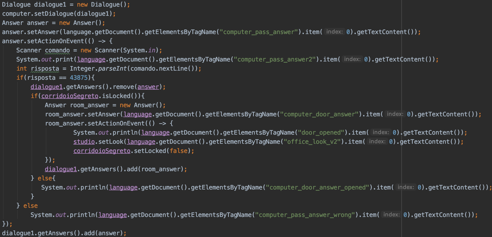

# Adventure gate by Domenico Sarcina

## Final project report

## 1.Introduction

For the ** Advanced Programming Methods ** course it was created as a final project
a text adventure. For its realization, ** Java ** was used as a programming language,
** XML ** as a language for .xml files and finally ** Maven ** as a build automation tool.

## 2. Data Structures

For the adventure text were defined data structures, these are:

***Action***: It defines only one method, which is the one used for actions that occur depending on a choice

***AdvObject***: It defines the composition of an object, with all its attributes and methods

***AdvObjectContainer***: Subclass of AdvObject, it defines the composition of a container object

***Answer***: It defines the single choice in a dialogue between object and user

***Command***: Defines the single game command

***Command Type***: It defines the types of commands that are present in the game

***Dialogue***: Defines the complete dialogue, with an Answer list of the single object

***Inventory***: Defines the composition of the user's inventory, a list of objects

***Player***: Defines the user's name, which can be customized at the start of the game

***Room***: It defines the composition of the single room in the game

***Language***: Defines the language of the game, Italian or English

#### AdvObject ####

|      id      | identification code of the object                          | Int         |
| :----------: | ---------------------------------------------------------- | ----------- |
|     name     | object name                                                | String      |
| description  | object description                                         | String      |
| turnableText | written behind the object, valid only for turnable objects | String      |
|    alias     | alternative names to identify the object                   | Set<String> |
|   dialogue   | possible dialogue for the object                           | Dialogue    |
|   openable   | if the object can be opened                                | Boolean     |
|  ignitable   | if the object is ignitable                                 | Boolean     |
|   turnedOn   | if the object is on                                        | Boolean     |
|  pickupable  | if the item is pickupable                                  | Boolean     |
|   turnable   | if the item is turnable                                    | Boolean     |
|  speakable   | if the object is interactable with a dialogue              | Boolean     |
|     open     | if the object is open                                      | Boolean     |
|    usable    | if the object is usable                                    | Boolean     |
|     key      | if the object is a key                                     | Boolean     |
|   roomKey    | which room opens the key object                            | Room        |

#### AdvObject Container ####

| Name | Description                                     | Type            |
| ---- | ----------------------------------------------- | --------------- |
| list | objects list that contains the container object | List<AdvObject> |

#### Answer ####

|     Name      |           Description            |         Type         |
| :-----------: | :------------------------------: | :------------------: |
|    answer     | single sentence of the dialogue  |        String        |
| actionOnEvent | actions due to the single choice | Action.actionOnEvent |

#### Command ####

| Name  |         Description         |    Type     |
| :---: | :-------------------------: | :---------: |
| type  |        command type         | CommandType |
| name  |        command name         |   String    |
| alias | other names for the command | Set<String> |

#### Dialogue ####

|  Name   |              Description               |     Type     |
| :-----: | :------------------------------------: | :----------: |
| answers | list of phrases available for dialogue | List<Answer> |

#### Inventory ####

| Name |          Description           |      Type       |
| :--: | :----------------------------: | :-------------: |
| list | list of items in the inventory | List<AdvObject> |

#### Player ####

| Name | Description |  Type  |
| :--: | :---------: | :----: |
| name | Hero's name | String |

#### Room ####

|    Name     |             Description             |      Type       |
| :---------: | :---------------------------------: | :-------------: |
|     id      |      Room identification code       |       Int       |
|    name     |             Room's name             |     String      |
| description |         Room's description          |     String      |
|    look     |  Momentary description of the room  |     String      |
|   locked    |        If the room is closed        |     Boolean     |
|  finalRoom  |       if it is the final room       |     Boolean     |
|    south    |      South facing room, if any      |      Room       |
|    north    |      North facing room, if any      |      Room       |
|    east     |      East facing room, if any       |      Room       |
|    west     |      West facing room, if any       |      Room       |
|   objects   | List of objects present in the room | List<AvdObject> |

#### Language ####

|   Name   |                         Description                          |   Type   |
| :------: | :----------------------------------------------------------: | :------: |
| language |                       Chosen language                        |  String  |
| document | document on which the xml file containing the strings is placed | Document |

## 3. User Manual

When starting the game, the user will be presented with a screen similar to the one below.

The user can choose to start the game, see the game's story or quit.

If the user chooses to view the game's story, this will appear.

If the user chooses to play, a screen like this will appear.

The user will be able to type a name for his hero, and choose a language among those supported.

If he wants to go back to the previous screen he will just have to press the Back button, to play the Start button, and this will appear.

The user will be able to see the commands by typing 'commands' or 'help' and a list of all available commands will appear.

The use of articles is also supported, the English one "the", and the Italian ones "il", "lo", "la", "i", "gli", "le".

When the user finds the room where the treasure is, the program will end.

Below is a list of all the items, and how you can use them.

|  Object  |                      Possible commands                       | Position on the Map    |
| :------: | :----------------------------------------------------------: | ---------------------- |
|  Drawer  |                   Openable, contains torch                   | Bedroom                |
|  Photo   | Usable in the secret corridor for the sensor, turnable to get the access code to the father's computer | Parent's bedroom       |
|   Key    | It can be taken and used to open the door of the father's study | Corridor               |
|  Torch   | It can be turned on and off, it is used to enter the treasure room | Bedroom(in the drawer) |
| Computer |    Can be used to unlock the door to the secret corridor     | Office                 |
|  Sensor  |           Can be used to unlock the treasure room            | Hidden aisle           |

## 4. Used tools

Have been used Java Swing, Lambda Expressions, File and Thread.

### Java Swing

The java swings were implemented at the beginning of the text adventure, as a main menu that the user initially refers to. The first Panel has 3 buttons, Play, History and Exit, with Play another Panel will open, where there will be a textField for entering the hero's name, a comboBox for choosing the language, and 2 other buttons, one to return to the previous panel, and the other to start the adventure.

The images of the Swings are present in the User Manual.

### Lambda Expressions

The lambda expressions have been implemented for the "dialogues" between the user and some objects, like computer and sensor, as the user had to interact with these objects, and each choice will have repercussions on the game map.

I used lambda expressions because I needed methods that I could implement when I needed them and that would be different for each type of user response.

In the beginning, the complete dialogue for the subject is created, which will include multiple responses. The individual answers will be created immediately after, and the action that will be performed if the user chooses a precise answer will be set.

In this case there is a situation of Lambda Expressions nested in that if the user chooses to enter the password, and if the entered password is correct, a new response will be created at the time which will have its own action assigned. If the user were to choose the new answer just created, in this case the action would be to unlock the Secret Corridor room.

Lambda Expressions were used for dialogue with the sensor and computer object.

### File

The Files have been implemented in the project for the possibility of having a multilanguage game. The languages specifically are Italian and English.

The files that are "named" are .xml files, and contain all the game strings that need translation.

This is a part of the strings_en.xml file where the English strings are present, the same thing done for the Italian strings.

The file is loaded and then passed to the Document type variable which allows me to load the strings using the tags present in the language file (.getElemetsByTagName ()).

### Thread

Threads have been added for loading the translation file, which must take place just before the actual game starts.

The run method of the thread is all the part that is shown about the language code.

The thread is called in the startPanel, just before starting the engine and the game.

## 5. Class Diagram

## 6. Algebraic Specification

Algebraic Specification of Room class

Sorts: string, boolean, Room, List<AdvObject>, int

Operations:

​	Room(int) -> Room

​	Room(int, string, string) -> Room

​	getName() -> string

​	setName(string) -> Room

​	getDescription() -> string

​	setDescription(string) -> Room

​	setLocked(boolean) -> Room

​	isLocked() -> boolean

​	getSouth() -> Room

​	setSouth(Room) -> Room

​	getNorth() -> Room

​	setNorth(Room) -> Room	

​	getWest() -> Room

​	setWest(Room) -> Room

​	getEast() -> Room

​	setEast(Room) -> Room

​	getObjects() -> List<AdvObject>

​	setFinalRoom(boolean) -> Room

​	getFinalRoom() -> boolean

For all the operators who are in the Remarks part it is understood that as a parameter they must have an object of type Room.

| Remarks          |                             |          |                             |                           | Costruttori di Room  |                      |                     |                     |                          |                           |
| ---------------- | --------------------------- | -------- | --------------------------- | ------------------------- | -------------------- | -------------------- | ------------------- | ------------------- | ------------------------ | ------------------------- |
|                  | Room(id, name, description) | Room(id) | setDescription(description) | setName(name)             | setSouth(south)      | setNorth(north)      | setWest(west)       | setEast(east)       | setFinalRoom(finalRoom)  | setLocked(locked)         |
| getName()        | name                        | Null     | setDescription(getName())   | name                      | Error                | Error                | Error               | Error               | Error                    | Error                     |
| getDescription() | description                 | Null     | description                 | setName(getDescription()) | Error                | Error                | Error               | Error               | Error                    | Error                     |
| isLocked()       | False                       | False    | Error                       | Error                     | Error                | Error                | Error               | Error               | setFinalRoom(isLocked()) | locked                    |
| getSouth()       | Null                        | Null     | Error                       | Error                     | south                | setNorth(getSouth()) | setWest(getSouth()) | setEast(getSouth()) | Error                    | Error                     |
| getNorth()       | Null                        | Null     | Error                       | Error                     | setSouth(getNorth()) | north                | setWest(getNorth()) | setEast(getNorth()) | Error                    | Error                     |
| getWest()        | Null                        | Null     | Error                       | Error                     | setSouth(getWest())  | setNorth(getWest())  | west                | setEast(getWest()   | Error                    | Error                     |
| getEast()        | Null                        | Null     | Error                       | Error                     | setSouth(getEast())  | setNorth(getEast())  | setWest(getEast())  | east                | Error                    | Error                     |
| getObjects()     | <>                          | <>       | Error                       | Error                     | Error                | Error                | Error               | Error               | Error                    | Error                     |
| getFinalRoom()   | False                       | False    | Error                       | Error                     | Error                | Error                | Error               | Error               | finalRoom                | setLocked(getFinalRoom()) |

Restriction:

for Room(id, name, description):

​	isThere(Room(id, name, description)) -> error

​	isThere(Room(id)) -> error

for setDescription(description):

​	isLocked(setDescription(description)) -> error

​	getSouth(setDescription(descritpion)) -> error, also valid for getNorth, getWest and getEast

​	getObjects(setDescription(description)) -> error

​	getFinalRoom(setDescription(description)) -> error

for setName(name): same as setDescription

for setSouth(south):

​	getName(setSouth(south)) -> error

​	getDescription(setSouth(south)) -> error

​	isLocked(setSouth(south)) -> error

​	getObjects(setSouth(south)) -> error

​	getFinalRoom(setSouth(south)) -> error

for setNorth(north), setWest(west), setEast(east) the same restrictions applied

for SetFinalRoom(finalRoom):

​	getName(setFinalRoom(finalRoom)) -> error

​	getDescription(setFinalRomm(finalRoom)) -> error

​	getSouth(setFinalRoom(finalRoom)) -> error

​	getNorth(setFinalRoom(finalRoom)) -> error

​	getWest(setFinalroom(finalRoom)) -> error

​	getEast(setFinalRoom(finalRoom)) -> error

​	getObjects(setFinalRoom(finalRoom)) -> error

for SetLocked(locked) the same restrictions applied for SetFinalRoom.